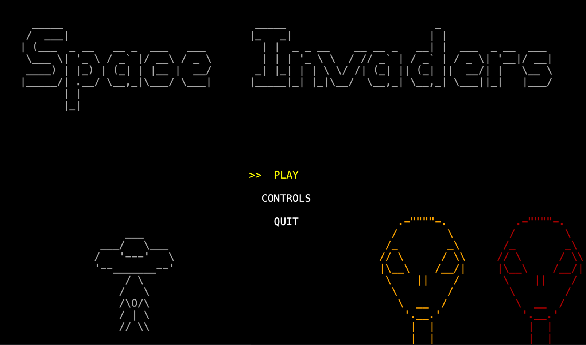
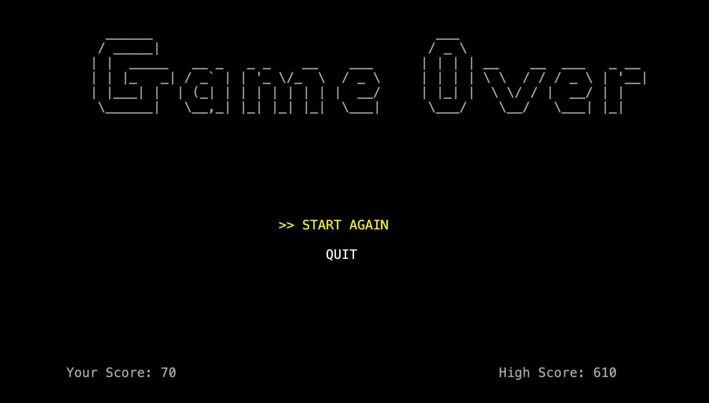

### Space Invaders Project - LDTS 2023/24

Developed by Gonçalo Barroso (up202207832@fe.up.pt), Gonçalo Matias (up202108703@fe.up.pt), and Rodrigo Arteiro (up202108749@fe.up.pt), this project is an engaging reimagining of the classic Space Invaders game. The player maneuvers a laser cannon across the screen's bottom, aiming and firing at overhead aliens. These aliens, arranged in five rows of eleven, shift left and right in unison, moving down each time they reach the screen's edge.

### Controls:

#### MOVEMENT
- **MOVE LEFT** – Press 'A' or Left Arrow Key
- **MOVE RIGHT** – Press 'D' or Right Arrow Key

#### SHOOTING
- **SHOOT LASERS** – Press 'Spacebar'

#### OBJECTIVE
- Destroy all invaders before they reach the bottom of the screen.
- Earn points for each invader destroyed. Bonus points for shooting mystery ships.

#### LIVES
- You start with 3 lives. Losing all lives ends the game.

#### TIPS
- Move quickly and shoot accurately. Use cover wisely.

### Showcase

#### Menu

#### Enter Game

#### Shields.

#### Normal ships and Mystery ships.

#### Game end (Game Over)

#### Controls Menu

