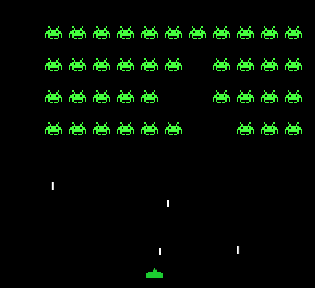

## Space Invaders Project - LDTS 2023/24

Developed by Gonçalo Barroso (up202207832@fe.up.pt), Gonçalo Matias (up202108703@fe.up.pt), and Rodrigo Arteiro (up202108749@fe.up.pt), this project is an engaging reimagining of the classic Space Invaders game. The player maneuvers a laser cannon across the screen's bottom, aiming and firing at overhead aliens. These aliens, arranged in five rows of eleven, shift left and right in unison, moving down each time they reach the screen's edge.

### Mockup of the Game in Arena

### Current Implementation

Our current codebase consists of two structures: an older version with partial implementation and a new version employing our chosen design patterns. Some features from the old structure are yet to be integrated into the new one. Consequently, the new version currently displays only a black screen. The older version, although not aligned with our design goals, already has some functioning features.

### Upcoming Features

- **Game Over Screen:** Triggered when aliens reach the bottom or the player loses all lives.
- **Movement Mechanics:** Players can move their character left or right, and aliens will move accordingly.
- **Shooting Mechanism:** Players shoot projectiles using the spacebar, while enemies fire at set intervals.
- **Bullet Collision:** Projectiles will disappear upon hitting an enemy or another bullet, with corresponding damage to the targets.
- **Lives Display:** Player's remaining lives shown in the screen's bottom left corner.

### Design Overview

#### Structure

**Context:** A cohesive game structure was required.

**Solution:** Implementation of the **Model-View-Controller (MVC)** pattern to segregate interfaces, controls, and computational methods into distinct classes.

**Benefits:**
- Streamlined, less complex individual classes.
- Simplified integration of future enhancements.

#### State Management

**Context:** The game transitions through various states like Main Menu, Arena, Game Over, and Controls screen.

**Solution:** Adoption of the **State** pattern, allowing the Application class to reference only the superclass of each state.

**Benefits:**
- Facilitates the addition of new states.
- Reduces redundant code.

#### Entity Management

**Context:** Various game entities share common methods.

**Solution:** Utilization of the **Factory** pattern, enabling subclasses to inherit common methods without reimplementation.

**Implementation Goal:** To create subclasses for Monster, PlayerShip, and Bullet under the Entity class.

**Benefits:**
- Streamlines the addition of new subclasses.
- Minimizes overall code redundancy.
